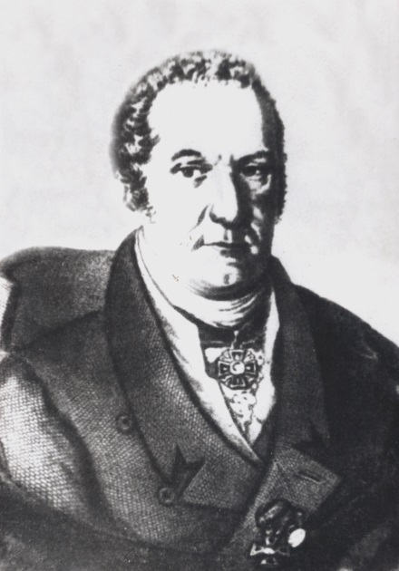
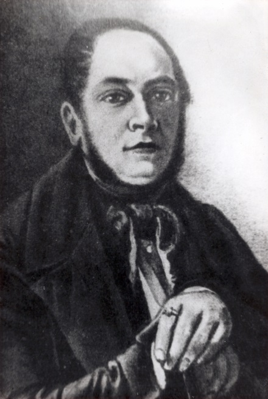
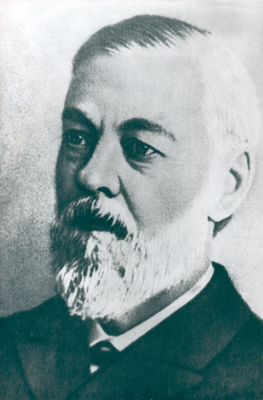
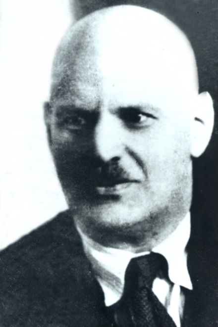
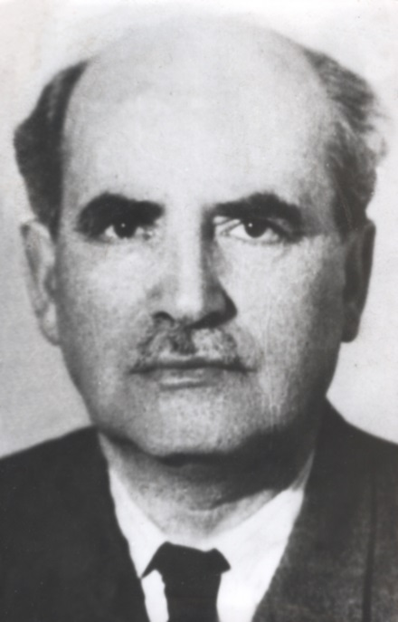
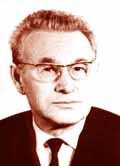
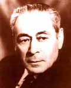
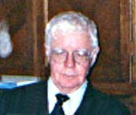

В 1755 году, уже через 10 лет после основания Московского университета, на медицинском факультете профессор С.Г. Зыбелин прочитал первые лекции по физиологии человека. В последующие годы физиология преподавалась в курсе других дисциплин рядом выдающихся профессоров, в числе которых были А. Керестури, П.Д. Вениаминов, И.А. Сибирский. 

Датой рождения кафедры физиологии в Московском государственном университете считается **1776 г.**, когда профессора М.И. Скиадан и И.И. Вечь начали регулярное чтение лекций по физиологии человека на медицинском факультете.

В течении 1807-1809 гг. курс физиологии и анатомии вел И.Ф. Венсович. После его смерти с 1811 по 1813 гг. кафедру возглавлял И.Е. Грузинов, прошедший перед этим стажировку в Англии, Франции и Германии. 

С 1813 по 1835 г. преподавание физиологии в Московском университете возглавлял выдающийся ученый профессор **Е. О. Мухин**, читавший наряду с этим лекции по анатомии, токсикологии, судебной медицине и медицинской полиции.

В 1835 г. преемником Е. О. Мухина по курсу физиологии стал **А. М. Филомафитский**, прошедший после окончания Московского университета подготовку в Дерптском университете, а также в лаборатории знаменитого физиолога Иоганнесса Мюллера. С именем А. М. Филомафитского связан важнейший период развития московской физиологической школы.
В это время происходит процесс дальнейшего выделения физиологии в особый предмет преподавания из общего комплекса анатомии, патологии, терапии, и т.п. В 1836 г вышли в свет два первых русских учебника по физиологии: в Петербурге - профессора Д. Веланского, а в Москве - А. Филомафитского под названием "Физиология, изданная для руководства своих слушателей". Филомафитский выступил горячим сторонником экспериментального метода в физиологии, который только что начал культивироваться в различных странах Европы. Особенной заслугой А. Филомафитского является также то, что он первый ввел в преподавание физиологии демонстрацию опытов на животных. 

Таким образом, благодаря деятельности А.М. Филомафитского Московский университет может считаться родоначальником экспериментальной физиологии в России.

После Филомафитского кафедру физиологии возглавляли И.Т. Глебов, А.И. Бабухин, Ф.Б. Шереметьевский, а с 1889 по 1901г. ею руководил крупнейший русский физиолог И.М. Сеченов. С именем **И.М. Сеченова** - создателя концепции рефлекторной деятельности и автора основополагающих исследований газов крови - связано мировое признание достижений российской физиологической школы.

После ухода в отставку И.М. Сеченова заведование кафедрой принял **Л.З. Мороховец**. При нем было осуществлено строительство нового института физиологии в Московском университете, здание которого было открыто в 1893 г. на Моховой улице, на территории университета. Л.З. Мороховец основал в 1888 г. издание серии "Труды физиологического института Московского университета" и в течение ряда лет был их редактором. 

В 20-х годах из состава Московского университета выделился медицинский факультет, а остающаяся в университете кафедра физиологии была реорганизована в кафедру физиологии человека и животных с базированием на биологическом факультете. С 1924 по 1930 г кафедрой руководил ученик И.М. Сеченова **А.Ф. Самойлов**. Профессору А.Ф. Самойлову принадлежат приоритетные исследования феномена синаптической задержки и ее температурной зависимости в химических нервно-мышечных синапсах. Под его руководством на кафедре велись исследования механизмов химической синаптической передачи с использованием электрофизиологических методов исследования на изолированном нервно-мышечном препарате и изолированном сердце.

Преемником А.Ф. Самойлова стал воспитанник Московского университета профессор **И.Л. Кан**, руководивший кафедрой до 1942 года. Его научные интересы были связаны с проблемой энергетики нервного возбуждения.

**Во время войны** часть преподавателей, научных сотрудников и студентов кафедры (проф. Х.С. Коштоянц, доценты М.В. Кирзон и К.С. Логунова) были эвакуированы, а другая (доцент М.Г. Удельнов и аспиранты Н.А. Келарева и В.А. Шидловский - оба вспоследствие доценты кафедры), которую возглавил профессор Г.К. Кекчеев, продолжала работать в Москве. Ряд сотрудников, аспирантов и студентов кафедры сражались на фронтах Великой Отечественной Войны. Так, выпускник 1941 г., Т.М. Турпаев (ныне академик РАН) с самого начала войны находился в действующей армии, принимал участие в штурме Берлина. Среди ушедших на фронт был ассистент В.П. Дуленко, старший лаборант, блестящий демонстрационный ассистент, талантливый экспериментатор В.С. Зикс, который в качестве командира взвода огневой разведки дошел до Кенигсберга. Студент Б.С. Кулаев, ныне ведущий научный сотрудник Института эволюционной физиологии и биохимии, ушел на фронт в 1942 г, участвовал в сражении на Курской дуге, командовал батареей противотанковых орудий, дважды был ранен. Погибли на фронте аспирант Захар Хургес - талантливый исследователь и студенты кафедры - А.И. Дамрин, Г.А. Лорх, В.А. Давыдов.

После возвращения из эвакуации в 1943 г. кафедру возглавил и руководил ею до 1961 г. **Х. С. Коштоянц**. Среди научного наследия профессора Коштоянца особое место занимают работы в области эволюционной физиологии. Его уникальная двухтомная монография по сравнительной физиологии была настольной книгой нескольких поколений студентов и специалистов-биологов. Перу Х. С. Коштоянца принадлежит также уникальная книга "Очерки по истории физиологии в России", равной которой нет в современной научной историографии.
Практически все научные представления Х.С. Коштоянца получили развитие в последующие годы и были успешно продолжены его учениками, работавшими на кафедре и за ее пределами - Т.М. Турпаевым, Д.А. Сахаровым, Г.Н. Бузниковым, Т.Г Путинцевой, М.А. Посконовой и многими другими. В настоящее время традиционные для кафедры фундаментальные сравнительно-физиологические исследования механизмов синаптической передачи продолжаются в группе О.П. Балезиной.

С 1932 г. по 1986 г. на кафедре преподавал и вел активную научно-исследовательскую работу профессор **М.Г. Удельнов**. Обладая редкой научной интуицией, он стал пионером в постановке и научной разработке ряда проблемных вопросов физиологии, связанных прежде всего с физиологией сердца и вегетативной нервной системы. Основное его положение о разнонаправленности и неоднозначности регуляторных нервных влияний на органы послужило толчком для многочисленных научно-теоретических исследований в этом направлении и к настоящему времени стало общепризнанным.

Яркой личностью на кафедре был профессор **М.В. Кирзон** - прекрасный лектор и специалист в области нервно-мышечной физиологии и физиологии ЦНС. Большой заслугой М.В. Кирзона явилось внедрение в научную тематику кафедры прикладных разработок, выполняемых по заказу министерства здравоохранения. В процессе выполнения этих тем на кафедре было подготовлено поколение специалистов в области нейрофармакологии и психофармакологии.
В это же время на кафедре трудилась целая плеяда талантливых ученых и педагогов, среди которых профессора В.Б. Розен, И.М. Родионов, Ц.В. Сербенюк, д.б.н. Т.М. Калишевская, к.б.н. Г.А. Малюкина, Г.Г. Базазьян, Г.Ю. Юрьева, М.А. Посконова, Н.Е. Бабская и многие другие. 

>С 1964 г. по 1985 г кафедрой заведовал профессор **Б.А. Кудряшов** - автор ряда основополагающих работ по механизмам свертывания крови, трех открытий и 20 изобретений, имеющих не только научное, но и практическое значение. Параллельно Б.А. Кудряшов продолжал возглавлять созданную им в 1940 г. лабораторию физиологии и биохимии свертывания крови (ныне - лаборатория защитных систем крови им. проф. Б.А. Кудряшова). В годы войны по заданию Комитета Обороны Б.А. Кудряшов разработал метод промышленного производства тромбина и этот препарат был внедрен в практику для остановки раневых кровотечений, что позволило спасти сотни тысяч раненых. Под его руководством в 1961 г. проф. Г.В. Андреенко был получен отечественный препарат фибринолизин, который успешно применяется в клиниках для лечения больных инфарктом миокарда, тромбоэмболией легочной артерии, тромбозом периферических кровеносных сосудов. Б.А. Кудряшов создал научную школу, получившую мировое признание. Открытие противосвертывающей системы организма расширило научные представления о регуляции жидкого состояния крови в организме, о природе тромботических осложнений и создало базу для последующих экспериментальных и клинических работ.

>И. П. Ашмарин, Г. Н. Копылова, Л.И. Чудаков 
 

С 1985 г. по 2006 г. кафедрой заведовал академик РАМН **Игорь Петрович Ашмарин**.
