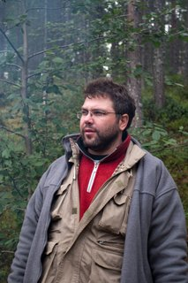

#Ловать Максим Львович

К.б.н., старший преподаватель

##Автобиография

Родился в 14.12.1972г. в г. Москве. 1989-1994г – студент, 1994-1998 - аспирант кафедры физиологи человека и животных биологического факультета МГУ. В 1998 году защитил кандидатскую диссертацию по теме: «Регуляция влечения к алкоголю при иммунизации к основным ферментам метаболизма этанола». Научные руководители: Ашмарин И.П., Данилова Р.А. , с 2002 года по настоящее время – старший преподаватель кафедры. С 2008 года – заведующий виварно-экспериментальным комплексом НИИ Митоинженерии МГУ.

Любимая цитата:
«Глаза боятся, а руки – крюки»

##Научные интересы

Изучение механизмов патологической тяги к алкоголю, роли иммунной системы организма в формировании и развитии алкогольной зависимости. Исследование роли антиоксидантов в механизмы запрограммированного старения. Животные модели: крысы, мыши, лягушки, рыбы.
	 
##Преподавательская деятельность

###Семинары

С 1995 года веду семинары по физиологии человека и животных на кафедре физиологи человека и животных биологического факультета МГУ.

###Лекции

С 2007 года читаю курс лекций по физиологии человека и животных студентам 2 курса факультета биоинженерии и биоинформатики.

###Практикумы

С 1995 года веду малый практикум по физиологии  человека и животных на кафедре физиологи человека и животных биологического факультета МГУ.

С 2002 года – руковожу летними практиками студентов биологического факультета МГУ (в зависимости от года – Звенигородская, Беломорская, Пущинская, либо международная (SUNY-МГУ, США)), являюсь начальником курса.

Руковожу диссертантами (2), дипломниками (7), курсовиками (12).

##Основные публикации

2012 - Up-regulation of 2-oxoglutarate dehydrogenase as a stress response Graf A., Trofimova L., Loshinskaja A., Mkrtchyan G., Strokina A., Lovat M., Tylicky A., Strumilo S., Bettendorff L., Bunik VI. в журнале International Journal of Biochemistry and Cell Biology, издательство Pergamon Press Ltd. (United Kingdom)
 
2012 - Влияние совместного введения ноотропа семакс и иммуномодулятора полиоксидоний на потребление этанола и параметры поведения предваритально алкоголизированных самцов крыс. Ефимова Е.В., Грозная А.А., Ловать М.Л. в журнале Технологии живых систем, том 9, № 10, с. 37-42

2010 - Behavioral impact of the regulation of the brain 2-oxoglutarate dehydrogenase complex by synthetic phosphonate analog of 2-oxoglutarate: implications into the role of the complex in neurodegenerative diseases. Trofimova L., Lovat M., Groznaya A., Efimova E., Dunaeva T., Maslova M., Graf A., Bunik V. в сборнике Int J Alzheimers Dis DOI

[Список публикаций в ИСТИНЕ](http://istina.msu.ru/profile/LovatMaxim/)

##Контакты

тел.: +7 (495) 930-10-67 или +7 (495) 939 -14 -16. 

Эл.почта: LovatM@gmail.com