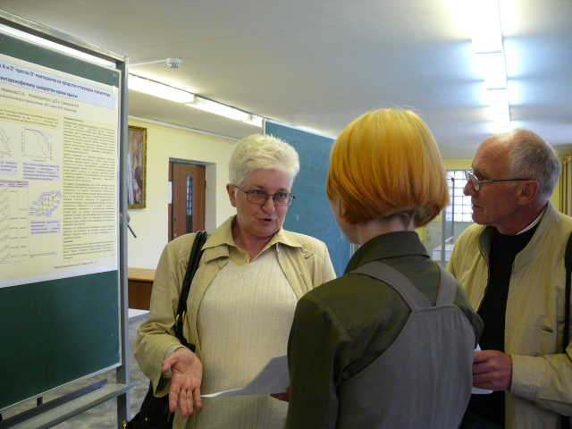

# Лаборатория эндокринологии (Смирнова О.В.)

Лаборатория была организована при кафедре физиологии человека и животных в 1954 году. С момента ее организации до 1964 года ее возглавлял виднейший советский эндокринолог Яков Михайлович Кабак. Исследования, проводимые в эти годы, внесли существенный вклад в развитие представлений о единой системе гипоталамо-гипофизарного контроля эндокринных функций. В эти и последующие годы в лаборатории успешно разрабатывались вопросы, связанные с изучением физиологической роли пролактина и тиреоидных гормонов, а также способы моделирования патологических состояний нейроэндокринной системы. 
С 1969 до 1992 года лабораторией руководил выдающийся ученый-эндокринолог, профессор Виктор Борисович Розен. К числу важнейших научных достижений В.Б.Розена и его школы относятся пионерские работы в области: исследования закономерностей взаимодействия гормональных стероидов с транспортными и рецепторными белками; анализа особенностей взаимодействия гормон-рецепторных комплексов с хроматином и нуклеиновыми кислотами; разработки проблемы половой дифференцировки функций вегетативных процессов, особенно функций печени. В этот период выдвинута оригинальная концепция о существовании особого типа регуляции биодинамики гормонов на клеточном уровне с помощью открытого в лаборатории нового класса регуляторных белков - стеромодулинов. 
С 1992 год по 2013 год лабораторию возглавлял Александр Николаевич Смирнов. В это время сотрудники лаборатории приступили к изучению новой области современной эндокринологии - исследованию молекулярных механизмов половой дифференцировки в норме и патологии, такой как атеросклероз; анализу структурных особенностей синтетических производных прогестерона, определяющих их избирательное взаимодействие с разными изоформами рецепторов для создания селективных аналогов гормонов; изучению особенностей тканеспецифической экспрессии и компартментализации рецепторов пролактина и роли этого гормона в регуляции пролиферативной активности и функций разных типов клеток печени; анализу роли рецепторов пролактина в успешном осуществлении оплодотворения in vitro. С 2013 года лабораторией руководит Смирнова Ольга Вячеславовна.

### Состав

- [Смирнова Ольга Вячеславовна]()
- [Сиротина Наталия Сергеевна]()
- [Щелкунова Татьяна Анатольевна]()
- [Исакова Марина Валентиновна]()
- [Маликова Аида Шамилевна]()
- [Кучер Антон Игоревич]()
- [Соболева Екатерина Борисовна]()

### Направления работы

### Сотрудничество

Ведется сотрудничество с:

- Институтом молекулярной биологии им. В.А. Энгельгардта РАН
- Институтом органической химии им. В.Д. Зелинского РАН
- Институтом атеросклероза, инновационный центр Сколково

### Контакты

С нами можно связаться по электронной почте: Smirnova_ov@mail.ru.
